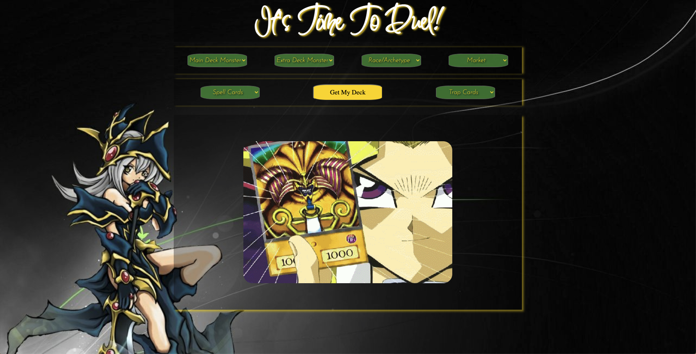

My Yu-Gi-Ooooh Deck
====================

### Getting Started
:star: [My Website][myWebsite] :star:

Ever dreamed of having your own Yu-Gi-Oh deck? Now you can! Get your cards virtually and plan out your deck using the information provided for each card, including the total amount to spend in real life!

#### API used 
Website: _[Yu-Gi-Oh!][apiWebsite]_

API endpoint - https://db.ygoprodeck.com/api/v7/cardinfo.php

### Parameters

###### name, id, type, race, attribute, cardset, level, atk, def, etc.

### Features
>:warning: **This is not an exhausted list**
>> *Results may vary for each card*
+ **id**: *num*
+ **name**: *string*
+ **base**: *string*
+ **type**: *string*
+ **desc**: *string of card description*
+ **atk**: *num*
+ **def**: *num*
+ **level**: *num*
+ **race**: *string*
+ **attribute**: *string*
+ **archetype**: *string*
+ **card_sets**: [set_name, set_code, set_rarity, set_price]
+ **card_image**: [image_url, image_url_small]
+ **card_prices**: [cardmarket_price, tcgplayer_price, ebay_price, amazon_price]

### User Stories
- [ ] Click on button to generate deck of 4 yu-gi-oh cards
- [ ] Click through to see each card and their info
  - displays name, type, description, race, attribute,and price
- [ ] Click on which market to display price on ebay, amazon, tcgplayer, card market

### Wireframes

### Technologies Used / Sources
+ **Javascript**
+ **HTML**
+ **CSS**
+ **[Slider Revolution][sliderSite]**
+ **[WallpaperAccess][bgimg]**

### Stretch Goals/Future Goals
- Allow user to make more than one deck and choose where the card will go.
- Allow more ard choices and randomize selection

### Screenshots

[apiWebsite]: https://db.ygoprodeck.com/api-guide/
[bgimg]: https://wallpaperaccess.com/yu-gi-oh#google_vignette
[myWebsite]: https://vchedeline.github.io/My_Yu-Gi-Oh_Deck/
[sliderSite]: https://www.sliderrevolution.com/resources/css-select-styles/